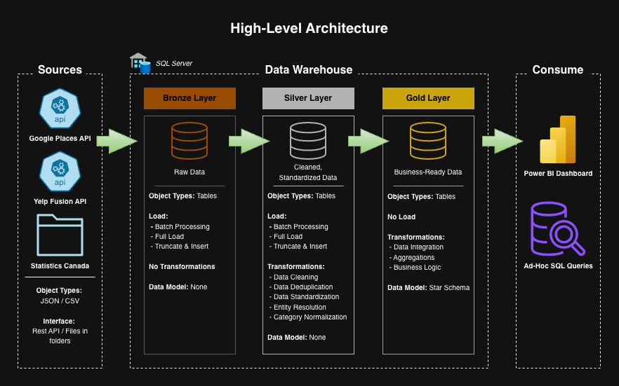

# Canada Restaurant Analytics

A data warehouse and analytics project built around Canadian restaurant data from the Google Places API, Yelp Fusion API, and Statistics Canada census data. Designed as a portfolio project demonstrating end-to-end data engineering and analytics, from API extraction to a structured warehouse, exploratory data analysis, and interactive Power BI dashboard.
 
---

## Project Overview

This project involves:

1. **Data Extraction**: Pulling restaurant and review data from the Google Places API and restaurant data from the Yelp Fusion API across five Canadian cities (Vancouver, Calgary, Edmonton, Toronto, Montreal), enriched with FSA data from the Google Geocoding API.
2. **Census Integration**: Incorporating Statistics Canada 2021 census data (population, median age, median income) at the FSA level across approximately 250 Forward Sortation Areas.
3. **Data Warehousing**: Loading raw data into a SQL Server warehouse using a Python-based ETL pipeline.
4. **Data Modeling**: Building fact and dimension tables in a star schema optimized for analytical queries.
5. **Exploratory Data Analysis**: SQL and Python-based analysis exploring restaurant ratings, price tiers, category popularity, neighbourhood demographics, and platform differences between Google and Yelp.
6. **Data Visualization**: Interactive Power BI dashboard connecting to the Gold layer, visualizing restaurant performance, category distribution, and demographic insights by city and FSA.

Skills demonstrated:
- Python ETL pipeline development
- REST API data extraction and pagination
- Multi-source data integration and entity resolution
- SQL Server data warehousing
- Medallion architecture (Bronze / Silver / Gold)
- Data modeling (star schema)
- Census data integration
- Docker-based SQL Server setup
- Exploratory data analysis (Python, pandas, matplotlib, seaborn)
- Data visualization and dashboard development
- Power BI integration and report design

---

## Data Architecture

The project follows the Medallion Architecture with Bronze, Silver, and Gold layers:

1. **Bronze Layer**: Raw data ingested from the Google Places API (restaurants, reviews) and Yelp Fusion API (restaurants, categories), along with Statistics Canada census CSV files. Each restaurant record is enriched with its FSA (Forward Sortation Area) during extraction via the Google Geocoding API.
2. **Silver Layer**: Data cleansing, standardization, and entity resolution - matching Google and Yelp restaurants on name and coordinates to create a unified restaurant dataset.
3. **Gold Layer**: Business-ready data modeled into a star schema for analytical queries and reporting.



---

## Exploratory Data Analysis

The EDA notebook explores approximately 2,000 restaurants across five Canadian cities, connecting restaurant performance metrics to neighbourhood demographics and comparing data quality and coverage between platforms.

Analytical questions explored:

1. Do neighbourhood demographics influence restaurant ratings?
2. Are expensive restaurants rated higher than budget ones?
3. Which restaurant categories are most popular in each city?
4. Which city has the biggest rating gap between Google and Yelp?
5. Which cities have the most consistent restaurants, and which are the most polarizing?

Key findings:
- Neither median income nor average age showed a strong correlation with restaurant ratings on either platform.
- Google ratings rise consistently with price tier, while Yelp shows the opposite pattern, pointing to fundamental differences in reviewer behaviour between platforms.
- Japanese cuisine dominates Toronto and Vancouver while Canadian (New) leads in Calgary and Edmonton. Montreal stands out with Poutineries as a regionally distinct category.
- Montreal is the most polarizing city on Google but the most consistent on Yelp, while Edmonton shows the reverse pattern.

---

## Tools & Technologies

- **Python** — ETL scripts, API calls, data loading, exploratory data analysis
- **SQL Server** — Data warehouse (running in Docker)
- **Google Places API** — Restaurant and review data
- **Google Geocoding API** — FSA enrichment
- **Yelp Fusion API** — Restaurant data and categories
- **Statistics Canada** — 2021 census data
- **Docker** — Local SQL Server instance
- **pyodbc** — Python to SQL Server connectivity
- **pandas** — Data processing and analysis
- **matplotlib / seaborn** — Data visualization
- **Power BI** — Dashboard development
 
---

## Data Sources

| Source | Data | Coverage |
|--------|------|----------|
| Google Places API | Restaurants, ratings, price level, reviews | Multiple Canadian cities |
| Google Geocoding API | FSA (postal area) lookup | Per restaurant coordinate |
| Yelp Fusion API | Restaurants, ratings, price level, categories | Multiple Canadian cities |
| Statistics Canada 2021 Census | Population, median age, median income | FSA level |
 
> **Note:** The raw Statistics Canada census file exceeds GitHub's file size limit and is not included in this repository.
> It can be downloaded directly from [Statistics Canada](https://www12.statcan.gc.ca/census-recensement/2021/dp-pd/prof/details/download-telecharger.cfm?Lang=E).
 
---

## Getting Started

### Prerequisites

- Docker
- Python 3.x
- Google Places API key
- Yelp Fusion API key

### Setup

1. Clone the repository:
```bash
git clone https://github.com/alekivetz/canada-restaurant-analytics.git
cd canada-restaurant-analytics
```

2. Create a virtual environment and install dependencies:
```bash
python -m venv venv
source venv/bin/activate
pip install -r requirements.txt
```

3. Create a `.env` file in the project root:
```
GOOGLE_API_KEY=your_api_key_here
YELP_API_KEY=your_api_key_here
DB_SERVER=127.0.0.1,1433
DB_NAME=DataWarehouse
DB_USER=sa
DB_PASSWORD=your_password
```

4. Start SQL Server in Docker:
```bash
docker run -e "ACCEPT_EULA=Y" -e "SA_PASSWORD=your_password" \
  -p 1433:1433 --name sql_server \
  -d mcr.microsoft.com/mssql/server:2022-latest
```

5. Initialize the warehouse:
```bash
# Run in SQL Server
init_warehouse.sql
```

---

## Pipeline

```bash
# 1. Extract source data
python -m scripts.extract.prepare_census
python -m scripts.extract.pull_google_restaurants
python -m scripts.extract.pull_google_reviews
python -m scripts.extract.pull_yelp_restaurants
 
# 2. Bronze layer — create tables and load raw data
-- Run in SQL Server: scripts/bronze/ddl_bronze.sql
python -m scripts.bronze.load_bronze
 
# 3. Silver layer — create tables, load, and validate
-- Run in SQL Server: scripts/silver/ddl_silver.sql
-- Run in SQL Server: scripts/silver/proc_load_silver.sql
-- Run in SQL Server: tests/quality_checks_silver.sql
 
# 4. Gold layer — build analytical models and validate
-- Run in SQL Server: scripts/gold/ddl_gold.sql
-- Run in SQL Server: scripts/gold/proc_load_gold.sql
-- Run in SQL Server: tests/quality_checks_gold.sql
```

---

## Repository Structure

```
canada-restaurant-analytics/
│
├── config/                             # Configuration and environment setup
│
├── data/
│   ├── prepared/                       # Cleaned source files ready for loading
│   └── raw/                            # Raw API and census outputs
│
├── docs/                               # Architecture diagrams and documentation
│
├── notebooks/                          # Exploratory data analysis
│
├── scripts/
│   ├── extract/                        # API extraction and data preparation
│   ├── bronze/                         # Raw data loading into Bronze layer
│   ├── silver/                         # Cleaning and transformation
│   ├── gold/                           # Business-ready data modeled into a star schema
│   └── init_warehouse.sql              # Warehouse initialization script
│
├── tests/                              # Data quality checks
├── utils/                              # Shared utility functions
│
├── .env                                # Environment variables (not committed)
├── .gitignore
├── requirements.txt
└── README.md
```

---

## License

This project is licensed under the [MIT License](LICENSE).